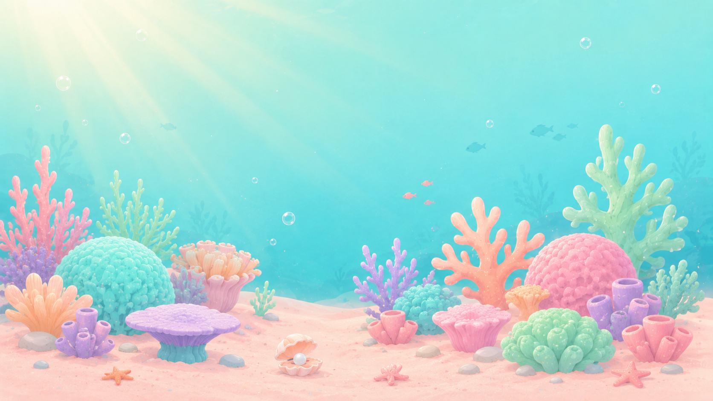

# 🤖 Bootstrap לסוכן חדש · המשך עבודת הפולס

**תאריך:** 2026-06-04
**עם:** מיטל פלג · אבני יסוד
**ספרינט קודם:** 3-4.6.2026 — איפיון + קטלוג + פולסים אינטראקטיביים. **הסוכן הקודם התעייף, יש לחדש.**

---

## 🎯 קרא קודם — חובה (15 דקות)

לפני כל פעולה, קרא את 3 קבצי הזיכרון האלה לפי הסדר. **אל תדלג.**

1. **`memory/project-pulse-session-2026-06-03-summary.md`** — מה נבנה, איפה כל קובץ
2. **`memory/project-inclusion-pulse-design-decisions.md`** — 10 ההחלטות הסגורות
3. **`memory/reference-avnei-yesod-visual-dna.md`** — ה-DNA הוויזואלי החובה (פסטל-שונית, scene-bg PNG, נוני התמנון)
4. **`memory/feedback-nuni-is-octopus-not-fish.md`** — נוני **תמנון סגול**, לא דג

אחר כך פתח.י את הפולס לתלמיד.ה ב-דפדפן והבן.י מה היה:

```powershell
Start-Process "C:\Users\meyta\Downloads\impactos\_handoff\intervention-catalog\live-pulse-student.html"
```

---

## 🔴 הבעיה הקריטית ביותר שצריך לפתור

**הרקעים של הפולסים הם gradient כחול-עמוק (#0E5A7C), לא scene-bg PNG פסטל-שונית.** זה שובר את ה-DNA של אבני יסוד.

### הסטטוס הנוכחי

הקובץ `_handoff/intervention-catalog/live-pulse-student.html` יש בו:
- ✅ נוני התמנון הסגול האמיתי (PNG מ-avnei-yesod) — תוקן 4.6
- ✅ swap דינמי של נוני (idle/happy/sad/thinking) לפי גרירה — תוקן 4.6
- ❌ **רקע**: gradient כחול-עמוק `linear-gradient(180deg, #0E5A7C → #1E7A9C)` — **שגוי**
- ❌ **כפתורים**: gradient כתום-זהב `#FFD66B → #FFB347` — צריך פסטל ים
- ❌ **טקסטים**: צבעים `#FFFFFF` על כחול עמוק — נראה כמו מסך לוגין, לא כמו אבני יסוד

### מה צריך להיות (לפי `memory/reference-avnei-yesod-visual-dna.md`)

```html
<body>
  <div class="scene-frame">
    
    <!-- כל התוכן מעל -->
  </div>
</body>
```

```css
.scene-frame {
  position: relative;
  width: 100vw;
  height: 100dvh;
  overflow: hidden;
  background: linear-gradient(180deg, #BFF1FF 0%, #A8E8FF 40%, #73D9D1 100%);
}
.scene-bg {
  position: absolute;
  inset: 0;
  width: 100%;
  height: 100%;
  object-fit: cover;
  object-position: center bottom;
  z-index: 0;
  pointer-events: none;
}
```

ראה.י את הרקע האמיתי בקובץ: `avnei-yesod/underwater-app/assets/scene-stage-3-bg.png` (Read tool כתמונה).

### צבעי כפתורים שמתאימים לפלטה

```css
:root {
  --water-main: #A8E8FF;
  --coral: #FFA98D;
  --shell-pink: #FFD3D8;
  --sand: #F8E3D6;
  --mint: #B8F2CF;
  --sea-green: #8ED9B8;
  --hint: #FFE7A8;
  --lavender: #D9D2FF;
  --text-main: #26505C;
}
/* CTA primary: */
background: linear-gradient(180deg, var(--coral) 0%, #FF8B6B 100%);
color: white;
/* CTA secondary: */
background: linear-gradient(180deg, var(--mint) 0%, var(--sea-green) 100%);
color: var(--text-main);
```

---

## 📋 רשימת מטלות מסודרת (לפי עדיפות)

### 🔴 P0 — חובה לפני כל הצגה למיטל

1. **תיקון רקע פולס תלמיד.ה** — להחליף gradient כחול-עמוק ב-`scene-stage-3-bg.png` + פלטה פסטלית. כל המסכים (welcome / vignette / drag / calm / finish).
2. **תיקון צבעי כפתורים בפולס תלמיד.ה** — מ-כתום-זהב לפלטה פסטלית (coral/mint/lavender לפי תוקנים).
3. **תיקון רקע + פלטה בפולס הורים** — `live-pulse-parent.html`. כרגע primary #2E7D8C (טורקיז עמוק), צריך להיות פסטל יותר. ההורים אמנם בוגרים, אבל ה-DNA צריך להיות עקבי.
4. **טופס המורה** — `2026-06-03-pulse-teacher-form-mockup.html` — תוקן עם פלטה מקצועית טורקיז (#2E7D8C). זה **בסדר** למורות (קהל בוגר, צריך תחושת כלי-מקצועי, לא משחק). **אל תיגע.** הפלטה הפסטל היא רק למסכי ילדים.

### 🟡 P1 — חשוב אבל לא חוסם הצגה

5. **תיקון נוני ב-`2026-06-03-system-10-pulse-v2.html`** — תוקן ב-4.6 (`.nuni-fish` עכשיו background-image של noni-idle.png) אבל המוקאפ הוא קטן. שווה לבדוק שזה נראה טוב בפועל.
6. **דני הדג בוינייט הפולס לתלמיד.ה** — SVG בכחול עמוק. צריך להתאים לפלטה פסטל (אולי כחול שמיים בהיר עם פנים עצובות עדינות).
7. **רקעי הקבצים `print-cat-*.html`** — חלק עם רקעים שגויים (לא תואמים DNA), חלק עם SVG דגים כתומים. סקור.י קובץ אחר קובץ.
8. **גרסה מנוקדת מלאה** לפולס הילד.ה — לוודא שכל מילה מנוקדת לפי כללי הניקוד הדקדוקיים ([[reference-hebrew-niqud-rules]] + [[reference-hebrew-bgd-kpt-dagesh-rule]]).

### 🟢 P2 — שיפורים נחמדים-להיות

9. **אינטגרציה Backend Supabase** — כרגע הפולסים standalone. צריך לחבר לדשבורד המורה ולשמירת תשובות.
10. **אילוסטרציות מקצועיות** לכרטיסי רגש ב-cat-03 (כרגע SVG פשוט inline). לבקש ממאיירת לעיצוב מקצועי.
11. **אינטגרציה עם דשבורד F.21E** של המורה הקיים.
12. **ניתוח אוטומטי NLP** לתשובות פתוחות של הורים — זיהוי מילות מפתח רגישות (פחד, בכי, מסרב).

### 🔵 P3 — חיצוני, צריך משאבים אנושיים

13. 🟡 **לוודא זמינות יועצת ב-4 בתי-ספר** — מיטל פלג · לירון גולן · אופיר שטיינברג · עמית אביטבול. **חוסם איפיון סופי.**
14. 🟡 **אישור פדגוגי משפ"י** על cat-03 + cat-08.
15. 🟡 **תיאום עם מתי"א** על cat-05.
16. 🟡 **בדיקה משפטית** למתכון "וידאו עצמי" ב-cat-10.
17. 🟡 **תרגום מלא לערבית** של 30 המתכונים (לבתי-ספר ערביים בירושלים בשנה ב').

---

## 🗺️ מפת הקבצים

```
impactos/
├── avnei-yesod/underwater-app/
│   ├── assets/
│   │   ├── scene-stage-3-bg.png ← השונית הקנונית (להשתמש כרקע)
│   │   ├── scene-stage-1-bg.png ← רקע שונית רך יותר
│   │   ├── noni-idle.png ← תמנון סקרני (ברירת מחדל)
│   │   ├── noni-happy.png ← שמח
│   │   ├── noni-thinking.png ← חושב
│   │   ├── noni-surprised.png ← מופתע
│   │   ├── noni-kiss.png ← חיבה
│   │   ├── noni-hero-transparent.png ← hero hi-res
│   │   └── island-03/storm-game/noni-sad-storm.png ← עצוב
│   └── css/
│       └── tokens.css ← הפלטה והעיצוב הסטנדרטי
│
└── _handoff/
    ├── 2026-06-03-pulse-grade1-2-research-and-spec-scaffold.md/.html
    ├── 2026-06-03-pulse-grade1-2-formal-spec.md
    ├── 2026-06-03-system-10-pulse-v2.html
    ├── 2026-06-03-pulse-teacher-form-mockup.html ← המורה (אל תיגע, פלטה מקצועית בכוונה)
    ├── 2026-06-04-pulse-next-steps-bootstrap.md ← הקובץ הזה
    └── intervention-catalog/
        ├── INDEX.md ← מערכת המלצות data-driven
        ├── cat-01..10-*.md ← 30 מערכי שיעור מלאים
        ├── live-pulse-student.html ← **לתקן רקע!**
        ├── live-pulse-parent.html ← **לתקן רקע!**
        └── printables/
            ├── HUB.html ← שער כניסה
            └── print-cat-01..10-*.html ← 115 דפי הדפסה (חלק עם SVG דג שגוי)
```

---

## 🚦 איך לעבוד עם מיטל

מיטל מצפה לעבודה רצינית-מקצועית. ההנחיות שלמדתי:

### 📌 הנחיות גלובליות שלה (מ-CLAUDE.md)
- **קהל מגוון** — בכל הסבר/דוגמה לכלול רלוונטיות גם לניהול/יזמות/שיווק. לא רק חינוך.
- שמירת זיכרון אקטיבית — שמרי כל הבנה חדשה לזיכרון
- ראה גם `~/.claude/CLAUDE.md` למלוא ההנחיות

### 📌 דפוסי עבודה מועדפים
- **multi-agent parallel pattern עובד** — לפצל למשימות מקבילות עם briefs ברורים. ראה [[feedback-orchestrator-multi-vscode-parallel-pattern]]
- **אל תשאל יותר מדי שאלות** — תקבל החלטות סבירות והצג. בעיקר על UX קטן
- **שותפים = נסיינות, לא צוות** — כל כלי דורש polish day-1. ראה [[feedback-avnei-yesod-partners-are-testers]]
- **דשבורד מורה = מסך אחד מאוחד** — אסור פיצול. ראה [[feedback-avnei-yesod-dashboards-fragmented]]
- **שפת מורה — פשוטה, לא טכנית** — לא BKT/EPA/strands. "שולטת היטב", "טועה באמצע מילים". ראה [[feedback-avnei-yesod-teacher-language-simplicity]]

### 📌 דברים שלא לעשות
- **אסור גרדיאנט כחול עמוק כרקע באבני יסוד** — חובה scene-bg PNG פסטל
- **אסור נוני SVG דג כתום** — נוני תמנון סגול (PNG קיים)
- **אסור Playpen / כתב יד** — Heebo בלבד בכיתה א'-ב'
- **אסור טקסט בלי ניקוד** במסכי ילד.ה
- **אסור Sub-BKT / strands** במסכי מורה — שפה פדגוגית פשוטה
- **אסור מסכי מורה מפוצלים** — איחוד למסך אחד
- **אסור raw form כדמו** — UX polished day-1
- **אסור כפתורים < 56px** במסכי ילדים

### 📌 דברים שתמיד לעשות
- **שמירה אוטומטית של זיכרון** — כל הבנה חדשה
- **commit סלקטיבי** — לא git add -A. בחירת קבצים ספציפיים
- **push אוטומטי כשבטוח** — tests עוברים + scope ברור = push בלי לשאול. אבל לעצור במסמכי-אם
- **multi-agent בעבודה גדולה** — parallelize when possible

---

## 🎬 הצעד הראשון הקונקרטי שלי לסוכן הבא

הצעת קריאת פתיחה לסוכן:

> שלום מיטל! עברתי על הזיכרון של הפרויקט. אני רואה שעבדת ספרינט עמוק על הפולס בימים 3-4.6 — קטלוג של 30 מערכי שיעור, 115 דפי הדפסה, 3 פולסים חיים. מצוין.
>
> בדקתי את הקבצים והאיתור הראשי הוא: הרקעים של הפולס לתלמיד.ה ולהורים הם gradient כחול עמוק, לא scene-bg של אבני יסוד. נוני כבר תוקן (תמנון סגול אמיתי), אבל הרקע עדיין שגוי.
>
> ההצעה שלי: אני מתקנת עכשיו את הפולס לתלמיד.ה — מחליפה את הרקע ל-`scene-stage-3-bg.png`, מעדכנת את הפלטה לפסטל אבני יסוד (coral/mint/lavender), ומתאימה את הכפתורים. זה ייקח כ-20 דקות. כן/לא?

---

## 📊 מצב הקבצים נכון ל-4.6.2026

### ✅ מוכן לחלוטין
- מסמך הספק הפורמלי
- 30 מערכי שיעור (10 קבצי .md)
- 115 דפי הדפסה (10 קבצי .html)
- INDEX.md עם מערכת המלצות + 9 תרחישי קצה
- מילון מונחים מקצועיים בסקאפולד
- 10 החלטות עיצוב סגורות
- טופס מורה אינטראקטיבי (לא לגעת!)

### 🟡 חלקית — דורש תיקון
- פולס תלמיד.ה — נוני תוקן, **רקע ופלטה צריכים תיקון**
- פולס הורים — **רקע ופלטה צריכים התאמה**
- v2 HTML — מוקאפ נוני קטן עם background-image, ייתכן זקוק לבדיקה ויזואלית

### 🔴 חוסם הצגה לטליה
- בדיקת ויזואלית של הפולסים החיים על-ידי מורות-פיילוט
- אישור עיצוב מיטל על פלטה+רקע

### 🔴 חוסם איפיון סופי
- זמינות יועצת ב-4 בתי-ספר

---

**שיהיה בהצלחה. הקובץ הזה ייצור הקשר מלא להצלחה.**

— הסוכן הקודם, 4.6.2026
